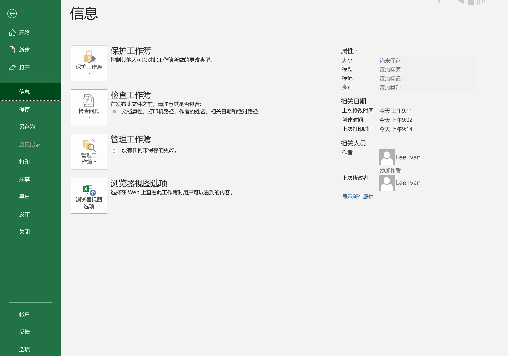
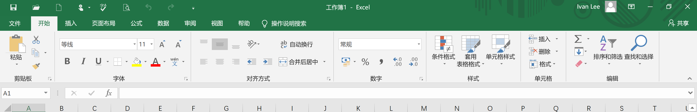
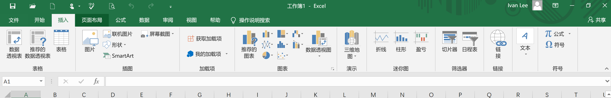
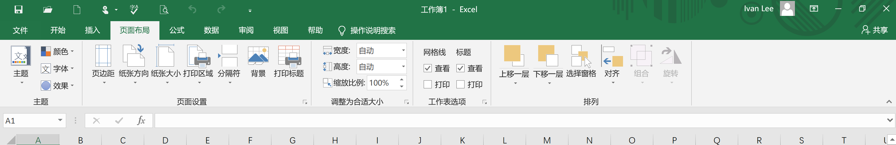
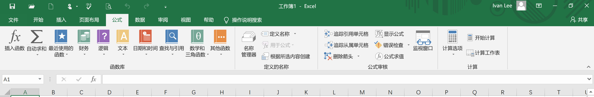
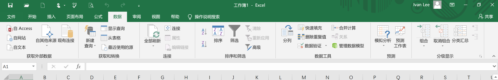
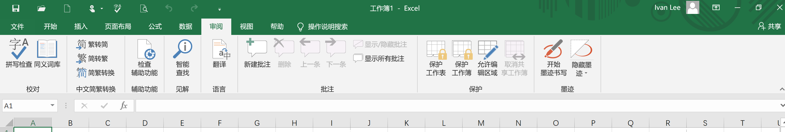

# 1. Excel的使用(预计4小时)
## Excel基本概念
Microsoft Excel是Microsoft是一款使用最为广泛的电子表格软件。

- 工作簿
	- 一个Excel文件, 就是一个工作簿
- 工作表
	- 一个sheet, 就是一个工作表
- 单元格
- 菜单介绍
	- 文件
		
	- 开始
		
	- 插入
		
	- 页面布局
		
	- 公式
		
	- 数据
		
	- 审阅
		

## Excel基本操作
- 数据导入
	- 从文件中导入
	- 从网站导入
	- 从数据库导入
- 开始菜单
	- 字体,边线,颜色,对齐方式,...
	- 条件格式
		- 突出显示单元格规则
		- 数据条
		- 图标集
		- 色阶
		- 新建规则
		- 清除规则
	- 套用表格格式|单元格样式|格式
	- 单元格 - 格式 -> 保护 - 锁定
- 数据菜单
	- 自动求和
	- 删除重复项
	- 排序
	- 筛选
	- 数据验证
## 公式函数
- 计算函数
	- countif
	- countifs
	- sumif
	- sumifs
	- rank
- 逻辑函数
	- and
	- or
	- not
	- if 
- 过滤/查找函数
	- index
	- match
	- vlookup
	- hlookup
	- indirect
- 文本函数
	- left
	- right
	- mid
	- find
	- len
	- substitute
	- concatenate与&
	- upper
	- lower
	- exact

## 透视表
- 制作透视表
- 切片器
- 数据透视图
- 美化
## 常见图形
- 折线图
- 散点图
- 柱状图
- 堆叠图
- 面积图
- 饼状图
- 环形图
- 旭日图
- 龙卷风图
- 漏斗图
- 树状图
- 组合图

## 说明:  一些简单的函数或图形中在后面业务中如果用到, 上面就不再介绍了. 

# 2. 全渠道业务分析(预计4小时)
## 公司说明 与 组织架构
- 是一家类似于百丽的多品牌鞋业集团. 

## 业务背景
- 需求背景
	- 传统电商、门店的隔离，两个场景
	   	- 电商: 库存备货问题; 举例: 电商销售曲线波动大，波峰突出明显，可是从商品运营效率出发，难以按照最高的波峰销量去备货，库存风险太大，但是大促一来，爆旺单款往往容易快速断货。
	      	- 门店: 调货流程繁琐,沟通成本高、效率慢、出错率高; 举例:   A店铺畅销款42码预售一双，店长首先自己查区域内店铺有没有库存，如果没有，然后请地区商品帮忙，查本经营区域内是否有库存，如果还没有，地区商品联系总部帮忙，查哪个地区哪个渠道有库存，查到了，开始多层转接沟通调货、发货事宜
	- 新业务
   		- 通过全渠道寻源分单系统，打破商品的渠道壁垒、更智能、快速、有效地实现商品在各种销售渠道的最优流转
- 项目导向:
	- 消费者认知上升
	- 消费者体验上升
- 项目目标
	- 商品效率最大化: 业务指标：周转天数
	- 销售利益最大化: 总体利润上升

## 业务逻辑
- 库存
	- 线上: 电商总仓
	- 线下: 门店仓
- 线上业务逻辑
	- 电商平台库存: 总仓 + 门店的一定比例(一般40%, 大促会下调) ,  原因: 线上必须是全新的货品, 门店有试穿的, 陈列的,有瑕疵的, 预售的 
	- 销售:
		- 线上订单 -> 电商总仓 -> 如果有总仓发货 -> 如果没有, 广播线下门店, 门店进行限时抢单(2小时) -> 超时没有接单, 系统根据收货地址就近指派(原因线上订单有发货时限)
		- 线下门店
			- 看到整体库存(全国门店+电商的)
			- 如果本店有就直接卖了
			- 如果没有就下全渠道订单 -> 如果电商仓有就电商仓发货, 如果电商仓没有就全国有这个商品的门店进行广播 -> 2小时抢单 -> 如果没有门店抢单 -> 就就近指派 

## 数据分析
- 数据收集
	- 中台: 全渠道的订单报表
	- 电商后台: 订单时效表
	- 客服: 发错货的订单信息
	- ERP: 门店信息, 全国销量表
- 数据处理
	- 格式转换
	- 缺失值、异常值处理
	- 根据业务指标增、删、关联字段
	- 汇总
- 数据分析
	- 占销比分析: 线上全渠道订单占比, 线下全渠道订单占比
	- 店铺参与度分析
	- 接单主动性分析
	- 门店发货量分析
	- 门店发货差错率分析
	- 奖励统计
- 报告(PPT)
	- 上升指标因为做了什么，内部、外部
	- 下降指标分析原因, 给出合理化建议
	- 运营工作诉求(跨部门的协同问题)

### 说明: 再制作课件的时候, 可能会把数据分析部分每一个分析都走一个完整的流程, 以帮助学生理解. 

 

# 3. 会员运营分析(预计2小时)
## 指导理论
- AIPL, 认知->兴趣->购买->忠诚 

## 流程 
- 拉新, 促活, 转换, 留存

## 业务说明
- 积分说明
- 会员等级
- 导购拉新奖励

## 拉新分析
- 明确目标: 统计每个月的会员增量, 
- 获取数据: 基础会员信息: 卡号, 手机号, 会员号, 姓名, 来源, 会员昵称, 注册时间, 店铺
- 数据处理
- 存量分析(月报):  	主要统计每一个月新会员增量
- 等级变换分析(月报)   关注黄金级及以上的会员增量
- 导购拉新奖励统计

## 会员价值分析

- 获取数据: 从CRM客户管理系统导出, 会员消费报表
- 数据处理
- 会员客单价分析: 
	- 计算公式: 客单价 = 会员消费总金额 / 订单数量
- 会员复购率分析
	- 年复购率: 年消费次数 >= 2 
	- 统计复购人数占比
- 客户等级划分

